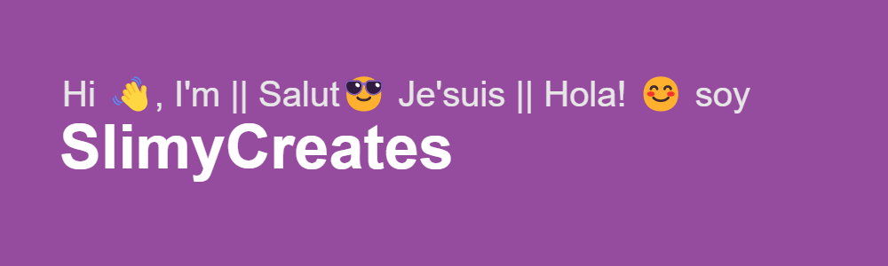

<table><tr><td valing="top">
 <h1 align="center">A fullstack developer, musician and designer based on Spain.</h1>  
  

- 🔭 I’m currently working on [KomiTS](https://github.com/reallyslimy/KomiTS)  
  

- 🌱 I’m currently learning Docker, NextJS and ContentStack  
  

- ❓ Ask me about anything related to tech and wear, I'm always open to good conversations!  
  

- ⚡ Fun fact: I wear glasses because I can't C#
  </td>
  <td>
    
  </td>
  </table>

   

## My Skill Set  
<table><tr><td valign="top" width="33%">

### Frontend  

  
  
  
  
  
  
  
  
  
  
  

  

### Design Software  

  
  
  
  
  
  
  

</td><td valign="top" width="33%">

### Backend  

  
  
  
  
  
  
  
  
  
  
  
  

  

### DB  

  
  
  
  

</td><td valign="top" width="33%">

### DevOps  

  
  
  
  
  
  
  

</td></tr></table>  

   

## Connect with me  

  

  
  

   

## Github Stats  

  

   

## Recent Blog Posts  
  

   

  

   

  
  

   

 

----

Generated using <a href="https://profilinator.rishav.dev/" target="_blank">Github Profilinator</a>

